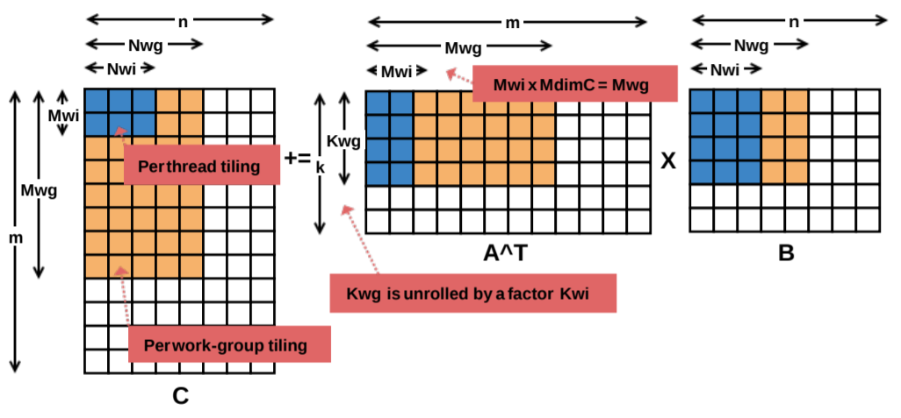

# Pràctica Kaggle APC UAB 2022-23
### Nom: Cristina Soler Arenys
### DATASET: GPU Kernel Performance Datset
### URL: https://www.kaggle.com/datasets/rupals/gpu-runtime

## Resum
Aquest conjunt de dades mesura el temps d'execució d'un producte matriu-matriu A · B = C. 
Totes les matrius tenen una mida de 2048 x 2048, utilitzant un nucli de GPU SGEMM parametrizable amb 241600 combinacions de paràmetres possibles.
Per a cada combinació provada, es van realitzar 4 execucions i els seus resultats es presenten com a les 4 darreres columnes. 
Tots els temps es mesuren en mil·lisegons. L'experiment es va executar en una estació de treball descriptori amb Ubuntu 16.04 Linux amb un Intel Core i5 (3,5 GHz),
16 GB de RAM i una GPU NVidia Geforce GTX 680 4 GB GF580 GTX-1,5 GB.

#### Informació dels atributs:
Independent variables:
1. `MWG`: per-matrix 2D tiling at workgroup level: {16, 32, 64, 128} (integer)   
2. `NWG`: per-matrix 2D tiling at workgroup level: {16, 32, 64, 128} (integer)   
3. `KWG`: inner dimension of 2D tiling at workgroup level: {16, 32} (integer)  
4. `MDIMC`: local workgroup size also defines the amount of work-per-thread in M dimensions: {8, 16, 32} (integer)  
5. `NDIMC`: local workgroup size also defines the amount of work-per-thread in N dimensions: {8, 16, 32} (integer)   
6. `MDIMA`: local memory shape: {8, 16, 32} (integer)  
7. `NDIMB`: local memory shape: {8, 16, 32} (integer)   
8. `KWI`: kernel loop unrolling factor: {2, 8} (integer)   
9. `VWM`: per-matrix vector widths for loading and storing: {1, 2, 4, 8} (integer)   
10. `VWN`: per-matrix vector widths for loading and storing: {1, 2, 4, 8} (integer)  
11. `STRM`: enable stride for accessing off-chip memory within a single thread: {0, 1} (categorical)   
12. `STRN`: enable stride for accessing off-chip memory within a single thread: {0, 1} (categorical)  
13. `SA`: per-matrix manual caching of the 2D workgroup tile: {0, 1} (categorical)
14. `SB`: per-matrix manual caching of the 2D workgroup tile: {0, 1} (categorical)

Output: 
15-18. `Run1`, `Run2`, `Run3`, `Run4`: performance times in milliseconds for 4 independent runs using the same parameters. They range between 13.25 and 3397.08.

### Objectius del dataset
L'objectiu és predir el temps d'execució del programa amb diferents paràmetres donats, usant la mitjana dels temps donats.

## Experiments
Les dades donades estaven pensades per realitzar regressions, però s'ha modificat la variable objectiu per convertir-la en una variable binària i també poder aplicar classificacions. És a dir, durant aquesta pràctica s'ha treballat tant en regressió com classificació. Per tant, 
podem predir quin serà el temps d'execució i també podrem mirar si el temps predit es troba
per sota la mitjana o per sobre.

### Preprocessat
Primerament agafarem les 4 variables de temps d'execució i realitzarem la mitjana d'aquestes per crear la nostre variable objectiu.
Mirem si tenim outliers a les dades, per eliminar-los i estalviar-nos problemes a l'hora de predir. Per detectar-los aplicarem el mètode del Z-score, 
bàsicament compararem les dades a partir de la desviació estàndar i eliminarem aquelles dades on el z_score sigui superior a un llindar establert.
Per arribar la millor distribució, s'aplica una transformació logarítmica a la variable objectiu, ja que millora la distribució i l'acosta més cap a una normal, 
la qual ens facilitarà l'avaluació dels models i donar-nos millors resultats.
S'han creat noves variables a partir de les ja existents, per intentar trobar variables amb més correlació. Finalment s'ha realitzat un One-Hot encoder a les variables
categòriques.

### Models

Abans d'aplicar els models de regressió s'ha fet una `feature selecction` amb una regressió `Lasso`.

Regressió:

| Model | Millors Hiperpàrametres | R^2 | Temps d'execució (sec) | Separació de dades (test-train)
| -----------| ----------------| --------| -----------| -------- |
| KNN |    k = 2       |0.91899 | 84.401 | 30% - 70% |
| SGD |  alpha = 0.001 |  0.63258 |0.4142 | 30% - 70% |
| RF  | criterion = 'squared_error', max_features= 1.0, n_estimators =100 | 0.99919 |46.120 | 30% - 70%| 
| KNN |    k = 2       |0.91899 | Temps Grid: 328.324 | 30% - 70%
| SGD |  alpha = 0.001 |  0.63258 | Temps Grid: 3.408 | 30% - 70% 

Classificació:

| Model | Millors Hiperpàrametres | ROC score | Temps d'execució  (sec) | Separació de dades (test-train)
| -----------| ----------------| --------| -----------| -------- |
| Regressió logística | solver= sag  |  0.9297 | temps Grid: 21.57 | 30% - 70% |
|Gradient boosting |      A        | 0.9884   | temps Grid: 1885.21 | 30% - 70% |
| Regressió logística | solver= sag  |  0.9100 | temps: 21.57 | 30% - 70% |
|Gradient boosting |      A        | 0.9700   | temps: 1885.21 | 30% - 70% |

## Demo
Per realitzar la demostració cal descarregar el contingut de la carpeta `Streamlit` situada al respositori de GitHub.
Pel tamany d'un dels fitxers no es pot penjar la pàgina pel seu funcionament online, per tant s'haurà d'obrir en local.

Descarreguem el contingut de la carpeta i el guardem en una carpeta local. Posteriorment obrim una consola de python dins l'ubicació de la carpeta. Per poder executar la pàgina en local caldrà tenir instalada la llibreria `Streamlit`. Per fer-ho haurem d'executar a la consola:

`pip install streamlit`

Un cop instalat ja podrem inicialitzar l'aplicació. Escrivim a la consola el següent:

`streamlit run Kernel_app.py`

Això obrirà una pestanya al navegador amb la pàgina funcionant al complet. Allà és pot visualitzar un anàlisi complet de les dades i realitzar prediccions i classificacions a partir de les dades que tu li proporcionis.

Altrament és pot executar el notebook per veure els resultats de l'anàlisi. Per fer-ho cal descarregar el notebook (extensió .ipynb) i obrir-lo amb un programa que 
ho permeti, ja sigui Google Colab o Jupyter Notebook. 
Tot i així es recomana usar el Dashboard per interactuar amb les dades ja que és la manera més intuitiva i fàcil.

## Conclusions
Com podem veure a la regressió, el model amb millors resultats és el `RandomForest Regression`, del qual obtenim un $R^2$ casi perfecte. 
Per tant, tot i que el model pugui ser més lent que algun altre, podem sacrificar temps per resultats i el millor model per predir les 
nostres dades haurà de ser un `Random Forest Regression` amb els paràmetres estàndars del model.

Dels dos classificadors aplicats el millor és el `GradientBoosting`, tot i que el temps d'execució és bastant més elevat, els resultats són 
molt més precisos. El temps del GradientBoosting és molt elevat durant el GridSearch si els paràmetresja es tenen es redueix, que és el que ens interesa.

## Idees per treballar en un futur
Crec que seria interesant si el dataset obtingues dades de altres processadors per mirar quin dona millors resultats i poder 
obtenir la millor combinació per executar el programa a màxima velocitat, i mínim temps.

## Llicència
Projecte desenvolupat per Cristina Soler Arenys
